<!---
À qui je m'adresse :
* Les développeurs Java qui ne connaissent pas du tout Groovy
* Les développeurs Java qui connaissent un peu Groovy (ex : Jenkins), mais n'ont jamais essayé/envisagé de l'utiliser en prod
* Les développeurs d'autres langages qui ont besoin d'un langage de script

C'est quoi l'objectif de l'article :
1. Convaincre que Groovy permet de coder vite (et plus vite qu'en Java)
2. Convaincre qu'on peut utiliser Groovy en production
3. Convaincre qu'on peut ajouter Groovy dans un projet existant facilement et sans risque (interopérabilité/compatibilité avec Java)
4. Convaincre que le langage est intuitif et facile à apprendre
5. Donner envie de proposer Groovy à sa team demain matin
--->

## I. Intro

"Développeur/euse Java" ça ne serait pas un peu réducteur en fait ?

Ce n'est pas du Java qui tourne sur nos serveurs, nos smartphones !

Et non, c'est bien du bytecode.

```puml
@startuml

agent "a a"
usecase "b b"

'a a' --> 'b b'

@enduml
```



On peut le générer avec plusieurs langages :

* Java (no kidding)
* Groovy
* Kotlin
* Scala
* Clojure
* JRuby
* Jython

Le bytecode généré est inter-compatible quel que soit son langage d'origine.

Cela signifie qu'une application Java peut avoir des classes dans un de ces langages, et elles peuvent toutes s'appeler entre elles.

On retrouve souvent ces langages parallèles dans des outils liés au test, à de la configuration et à l'automatisation :

* Groovy dans Spock, Jenkins, Gradle, Geb, Soap UI
* Scala dans Gatling

Et on peut parfaitement les utiliser dans du code de production, ce que j'ai fait pendant presque 2 ans par le biais du framework Grails (Groovy On Rails). Je n’avais jamais utilisé un transcodage esprit vers code aussi efficace.

Cet article présente les features de Groovy (3.0.10) pour coder ses idées à toute vitesse.

## II. Les facettes de Groovy

Voici les caractéristiques et principes qui d’après moi, permettent à Groovy d’être si efficace :

### Facette 1 : Une courbe d’apprentissage plate

La transition Java vers Groovy se fait très facilement comparé à Kotlin et Scala.

Pourquoi ?

Une ligne Java compile aussi en Groovy !

Et oui, on peut donc apprendre Groovy **itérativement** depuis du Java.

### Facette 2 : Des conventions plutôt que de la configuration

Admettons-le, configurer c’est lourd. C’est surtout dans le design et l’écriture du code métier qu’on souhaite dépenser
notre précieux temps.

C’est probablement pour cette raison que les frameworks Springboot et Micronaut sont si appréciés ; ils appliquent ce
concept.

**Voici ma sélection de 10 features Groovy qui soutiennent ce principe :**

#### Features 1 : Plus besoin de point virgule

Attendez, je le répète.

**Plus besoin de point virgule**

C’est une étape décisive pour l’obtention d’un code avec une charge utile maximale.

#### Features 2 : List et map Literals

Si je devais citer une seule feature de Groovy, ce serait celle-ci. Déclarer et initialiser des `Collection` et des `Map`
en java est très verbeux.

Comparez vous-même pour une `ArrayList` (mutable) :

Java :

```java
var users = new ArrayList<>() {{
	add(user1);
	add(user2);
}};
```

Je suis sympa, c’est du Java 11, ce qui nous économise le type. Sinon ça aurait été pire.

Groovy :

```groovy
var users = [user1, user2]

// Ou bien :
var user2 = [
	user1,
	user2,
]
```

Par **convention**, `users` est une `ArrayList`. Mais on aurait pu avoir un autre type de `Collection`,
voire un `array` :

```groovy
User[] usersArray = [
	user1,
	user2,
].toArray()

LinkedList<User> usersLinkedList = [
	user1,
	user2,
] as LinkedList

Set<User> usersSet = [
	user1,
	user2,
].toSet()

var usersForever = [
	user1,
	user2,
].asImmutable()
```

Même chose pour les map literals, dont voici la comparaison de syntaxe Java vs Groovy :

En Java (et à grand renfort d’imports statics) :

```java
import static java.util.Map.entry;
import static java.util.Map.ofEntries;

var userByGroup = ofEntries(
	entry(groupe4,user1),
	entry(groupe2,user2)
	);
```

Là aussi, on est très content du type dynamique, à partir de Java 11.

Mais en Groovy, c’est bouilli à la plus pure charge utile :

```groovy
var userByGroup = [
	(groupe4): user1,
	(groupe2): user2,
]
```

Aucun caractère n’est superflu. Même les parenthèses de clés sont bien de la charge utile, car elles indiquent que la
clé est une instance d’objet et non la `String` `"groupeX"`.

#### Features 3 : Default getters and setters

Les getters et setters sont facultatifs et ajoutés implicitement sur tous les champs avec le scope par défaut (empty),
comme avec les records et les data-classes/value-classes Lombok.

```groovy
class Foo {
    int id
}

var foo = new Foo(id: 1)
assert foo.getId() == 1
```

#### Features 4 : Les affectations sont des alias des setters

```groovy
foo.id = 2
// Dans le bytecode c'est foo.setId(2) qui est appelé
```

Regardez, si on surcharge le `setId` par défaut et qu’on y place un breakpoint, ce code y passe.


#### Features 5 : Les récupérations sont des alias des getters

```groovy
foo.id = 2
// Dans le bytecode c'est foo.getId() qui est appelé
```

Il est aussi surchargeable.

#### Features 6 : Un constructeur par défaut avec des paramètres nommés

```groovy
class User {
    int id
    String name
}

var user = new User(id: 1, name: 'foo')
```

#### Features 7 : Des arguments de méthode par défaut

Les paramètres de méthodes peuvent être rendus facultatifs :

```groovy
String run(String param1, int param2 = 0) {
    println "$param1 + : $param2"
}

run('Fizz', 8) == 'Fizz : 8'
run('Fizz') == 'Fizz : 0'
```

On a économisé la méthode `run(String param1)`

#### Features 8 : Le scope par default est `public`

Plus besoin de spécifier le scope public


L’IDE nous l’indique d’ailleurs en grisant les mot-clés facultatifs.

#### Features 9 : Default obvious imports

Plus besoin des imports évidents, ils sont faits implicitement :

- java.lang.\*
- java.util.\*
- java.io.\*
- java.net.\*
- groovy.lang.\*
- groovy.util.\*
- java.math.BigInteger
- java.math.BigDecimal

#### Features 10 : Manipuler des `File` devient simple !

Récupérer le contenu texte d’un fichier ? Trop facile. Écrire du texte dans un fichier ? Pareil.

```groovy
var file = new File("src/main/resources/one.tmpl")
var textContent = file.text
textContent += '''
final line
'''
file << textContent // Alias vers file.write(textContent)
```

En Java :

```java
var path = Paths.get("src/main/resources/one.tmpl");
var textContent = Files.readAllLines(path).join("\n")
byte[] strToBytes = "final line".getBytes();
Files.write(path, strToBytes);
```

On voit que le code Groovy se repose sur les opérateurs pour manipuler le contenu d'un fichier, contrairement à Java qui utilise l'API Files + quelques "glues" entre les traitements.   

En parlant d'opérateurs...

### Facette 3 : Des opérateurs de haut niveau d’abstraction

Groovy est inspiré de Python et Ruby pour ses opérateurs, dont voici mes 7 petits préférés :

#### 1.) Le Spread operator `*.`

Il permet d’invoquer une action sur tous les éléments d’une `List` disposant de cette action.

```groovy
class User {
    void sendMessage(String message) {
        queue.send(this, message)
    }
}

users*.sendMessage('unsubscribe')
```

Ici, chaque `User` envoie le message.

En Java, ça aurait été légèrement plus verbeux :

```java
users.forEach(user -> user.sendMessage("unsubscribe"));
```

#### 2.) L’equal operator `==`

> Oui et alors, on a aussi un equal-equal en java, non ?

Oui, mais dans le cas de Groovy, si un `.equals(Object obj)` est présent dans la classe, alors cet opérateur en sera un alias. La comparaison de 2 instances similaires sera true en Groovy (false en Java), ce qui est plus intuitif quant au mot.

```groovy
import groovy.transform.EqualsAndHashCode

@EqualsAndHashCode
class Foo {
    Integer a
}

var one = new Foo(a: 1)
var two = new Foo(a: 1)
assert one == two
```

C'est effectivement plus intuitif.

L’égalité de java est transféré sur l’opérateur `===` (on ne voudrait pas perdre une fonctionnalité tout de même).

#### 3.) L'Elvis operator `?:`

Il permet d’affecter une valeur par défaut si l’élément de gauche est `false` (`null`, zéro et vide sont `false` en Groovy).

On évite alors les ennuyants ternaires du genre
`displayName = user.name ? user.name : 'Anonymous'`. Les `Optional` deviennent alors beaucoup moins nécessaires pour la
null-safety.

```groovy
displayName = user.name ?: 'Anonymous'
```

`user` peut être `null` ? No problem, on en vient donc aux safe-operators

#### 4.) Les Safe-operators `?.` et `?[]`

Le premier est le "safe navigation op" et le 2ᵉ est le "safe index op". Ils permettent tous deux d’éviter les
'NullPointerException'.

```groovy
var displayName = user?.name ?: 'Anonymous'
var secondBook = user?.books ?[1] ?: Book.prototype
```

Avec seuls trois opérateurs, on traite tous les cas de nullité possibles et le one-liner se comprend très bien.

#### 5.) Elvis-assignment-operator `?=`

Vous avez besoin d’éviter à tous pris la nullité d’une variable ? Initialisez-la seulement quand elle est effectivement
`null` avec l’elvis-assignment-op :

```groovy
var userDto = userRestRepository.get('123')
userDto.name ?= 'John Smith'
```

Avec tous les op de null-safety, le principe de convention-over-configuration prend tout son sens.

#### 6.) Range operator `..`

On peut créer des plages d’entiers ou de char et itérer dessus directement :

```groovy
('a'..'g').each { println it } // prints a b c d e f g
(1..5).each { println it } // prints 1 2 3 4 5
```

On peut aussi se servir des `range` pour sublister une collection :

```groovy
[1, 2, 3, 4, 5][3..-1] == [4, 5]
[1, 2, 3, 4, 5][0..3] == [1, 2, 3, 4]
```

#### 7.) Spaceship operator `<=>`

C’est un alias de `.compareTo()`

```groovy
assert ('a' <=> 'd') == -1
assert ('a' <=> 'a') == 0
assert ('g' <=> 'a') == 1
```

### Facette 4 : Des high order functions natives sur les structures de données

L’activité probablement la plus récurrente dans un backend, est de manipuler des structures de données.

Les api Function et Stream ont révolutionné cette pratique. Mais l’intelligibilité est encore limitée par la verbosité de
Java.

Voyez plutôt :

```groovy
var entiers = [1, 2, 3]

//collectEntries (convert list to map)
Map<Integer, User> userById = entiers.collectEntries { [(it): userRepository.findById(it)] }

//groupBy
entiers.groupBy { it > 2 } == [false: [1, 2], true: [3]]

//split
entiers.split { it > 2 } == [[3], [1, 2]]

//average
entiers.average() == 2

//min with closure
var userWithMinBalance = entiers.min { userRepository.findById(it)?.balance }

//intersection
entiers.intersect([3, 4, 5]) == [3]

//indexation
entiers.indexed == [0: 1, 1: 2, 2: 3]

//combinations
[[1, 2], ['a', 'b']].combinations() == [[1, a], [2, a], [1, b], [2, b]]

//permutations
entiers.permutations() == [[1, 2, 3], [3, 2, 1], [2, 1, 3], [3, 1, 2], [1, 3, 2], [2, 3, 1]]

//collate (partitionner)
(1..10).collate(3) == [[1, 2, 3], [4, 5, 6], [7, 8, 9], [10]]
```

Et je ne m’arrête pas, car je suis à court, mais parce que vous avez saisi l’idée : toute opération de transformation
existe nativement dans Groovy, et les mixer entre elles donne des possibilités infinies tout en conservant une
lisibilité accrue.

## III. Intégrer Groovy dans un projet Java existant

Il faut configurer la "joint-compilation", pour compiler le Java et le Groovy. L’idéal est d’utiliser **Gmavenplus** :

```xml

<plugin>
	<groupId>org.codehaus.gmavenplus</groupId>
	<artifactId>gmavenplus-plugin</artifactId>
	<version>1.13.0</version>
	<executions>
		<execution>
			<goals>
				<goal>execute</goal>
				<goal>addSources</goal>
				<goal>addTestSources</goal>
				<goal>generateStubs</goal>
				<goal>compile</goal>
				<goal>generateTestStubs</goal>
				<goal>compileTests</goal>
				<goal>removeStubs</goal>
				<goal>removeTestStubs</goal>
			</goals>
		</execution>
	</executions>
	<dependencies>
		<dependency>
			<groupId>org.codehaus.groovy</groupId>
			<artifactId>groovy-all</artifactId>
			<version>3.0.9</version>
			<scope>runtime</scope>
			<type>pom</type>
		</dependency>
	</dependencies>
</plugin>
```

Si votre prod n'est pas prête à acceuillir Groovy, peut-être que votre stack de test l'est. Il suffit alors de configurer la joint-compilation Gmavenplus en scope test uniquement avec `<scope>test<scope>`.

## IV. Démarrer un projet Groovy from scratch

Plusieurs solutions s’offrent à nous :

### 1.) Grails (Groovy on Rails)

C’est un framework du même créateur et maintenu par le même société
(Object Computing)

```shell
grails create-app myApp
cd myApp
grails run-app
```

### 2.) Springboot

Le spring initializr permet de générer un projet groovy (2.5.6 max en octobre 2021).


### 3.) Micronaut

Idem avec le Micronaut sarter


### 4.) Gradle

On peut aussi faire des applications Groovy pur depuis Gradle :

```shell
Gradle 7.2
gradle init
```


Ce qui nous donne cette jolie app Gradle avec une entrypoint class `App` :


## V. Notre prod n’est pas prête pour Groovy, mais notre stack de test l’est, comment faire ?

Ajouter la joint-compilation Gmavenplus en scope test uniquement.

Mais tant qu’à faire du Groovy dans les tests, pourquoi ne pas utiliser directement [Spock-framework](https://spockframework.org/) et [Gebish-framework](https://gebish.org/) ?
