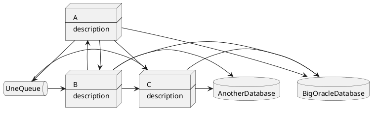

# Les applications modulaires permettent de scaler en RH + perf

## Pitch

### De quoi ça parle ?

D'app modulaires, qu'est-ce que c'est que la modularité, comment l'atteindre, qu'est-ce que ça apporte -> scaler en RH + perf

### À qui je m'adresse ?

À des membres de dev team et des coordinateurs/managers, des CTO, des stackholders.
Ils ont déjà travaillé dans des contextes où les teams ont du mal à paralléliser et à coordonner leurs efforts pour livrer de la valeur business.
Ils travaillaient alors sur du code commun ou sur des applications/modules fortement couplés.
Dans ces contextes, la MEP est un évènement, demande la coordination de toutes les équipes, et un déploiement global de la plupart des composants du système.
Ils ont observé que ça ne fonctionnait pas aussi bien que ça pourrait.

### De quoi je veux convaincre ?

Je veux les convaincre que rendre nos applications/systèmes modulaires permet de scaler en RH ainsi qu'en charge d'utilisation utilisateur (perf).
Pour ça, je veux leur donner ma définition de :
* scaler
* module
* couplage/découplage
* Archi hexagonale
* API
* Bounded context
* (cohésion)
* système distribué
* système monolithique

## Plan

1. 

## brainstorm area

De quoi je veux parler ?

D'applications modulaire.

Qu'est-ce qu'un module.

C'est une extension facultative à un système autonome.

L'ajout d'un module au système ajoute un ou plusieurs fonctionnalités à ce système.

L'ajout d'un module est facile et simple (plug-n-play but not hack-n-...).

Un module est une encapsulation de fonctionnalités.

Le module expose ses fonctionnalités par des interfaces.

Le système accède aux fonctionnalités d'un module par ses interfaces.

Le système utilise les fonctionnalités de ses modules et en est donc dépendant.

On ne peut alors plus supprimer le module sans affecter les fonctionnalités du système.

Toute dépendance cyclic entre le système et un module indique que le module devrait plutôt faire partie du système.

Toute dépendance cyclic entre 2 modules indique que ce devrait plutôt être un seul module.

Et donc, c'est toujours le système qui utilise les fonctionnalités du module, mais jamais le module qui appelle des fonctionnalités du système. Sinon, ce n'est pas un système modulaire, mais un seul et même système local. Et s'il y a du réseau entre les 2, c'est en plus un système distribué, avec toutes les complications que çæ apporte.

L'existence d'un module a au moins 2 origines :
* Il a été crée en tant que tel
* Il a été extrait d'un système existant

Tout système autonome peut être module d'un autre, à condition qu'il expose ses fonctionnalités à travers des interfaces, et qu'il n'ait pas de dépendance vers l'autre système. 

Bon on est ok sur le concept de module.

Mais en fait on n'a même pas encore parlé de software.

Nos applications sont-elles intrinsèquement modulaires ?

Non bien sûr. En définissant un module, j'ai évoqué les contraintes permettant la modularité, et elles ne s'appliquent pas d'elles-mêmes.

Il faut produire de l'effort pour les appliquer.

Alors, pourquoi dépenser cet effort, non-gratuit ?
Pourquoi se contraindre à rendre nos applications modulaires ?

Il y a selon moi au moins 2 sortes de contraintes :
* Celles que l'on choisit de s'imposer. Exemples : 
  * Dépendre des interfaces plutôt que de leurs implémentations
  * Faire des tests auto
* Celles qui finissent par s'imposer d'elles-mêmes. Exemple :
  * Déployer seulement 1 fois par mois de 20h à minuit, après 2 semaines de tests e2e manuels

Si on s'était imposé les 2 premières, alors la 3ème ne se serait surement pas imposé d'elle-même.

Autrement dit : En s'imposant délibérément et judicieusement des contraintes, on peut s'éviter des mauvaises.

Ok donc quelles sont-elles ces "mauvaises" contraintes qui s'imposent dans une grosse applications non modularisée ? 

Prenons un bon gros monolithe distribué :

// schéma

Qu'y observe-t-on ?
* A dépend d'un endpoint de B
  * Pas de contrat d'interface sur ce endpoint
* Le contexte métier des "xxx" est réparti dans A, dans B et dans C.
* Quand A change pour faire plaisir à B, C qui dépend aussi de A connait une régression, à moins de s'adapter lui aussi.

Contraintes (et leurs effets) : 
* Les inter-dépendances, l'absence d'abstraction par l'encapsulation, la dispersion des contexts métiers, font que chaque développeur doit connaitre la totalité de l'application pour y apporter tout changement.
  * Leur charge mentale déborde -> ils font des erreurs 
  * Définir le scope fonctionnel des tests unitaires est difficile
* les tests unitaires (fonctionnel) doivent traverser plusieurs applications/modules être complets (complet = tester le retour + 100% des effets de bord d'un usecase)
  * Ils passent par la stack réseau et sont donc très lents
    * Plus de refacto possible
      * Le système "rot" -> pourri
        * Développer des features est long
        * Il y a souvent des régressions
          * Le business s'effondre (à moins de ne pas avoir de concurrence)
          * Le moral de l'équipe baisse
          * Patatra
          * Dans certain cas, on continue d'injecter du pognon pour maintenir le système en survie
            * On blame le management alors que tout vient d'un manque de design et de rigueur de la dev team
  * Ils ne sont même plus faits
  * Ils sont remplacés par des tests manuels

Les effets ne sont effectivement vraiment pas cool.
Ils amènent d'ailleurs à la question : C'est quoi les objectifs fondamentaux des acteurs d'un logiciel ?

Je vous propose ceux-là :
* Job satisfaction
* organizational performance
* non-commercial performance

* less burnout
* less deployment pain
* less rework

Qui sait où j'ai été prendre ces objectifs ?