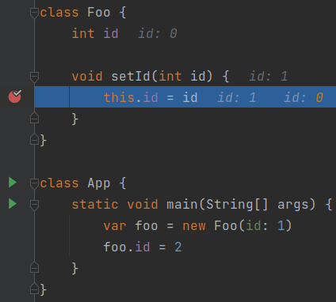
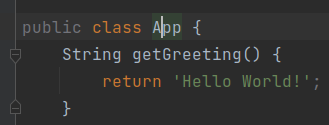
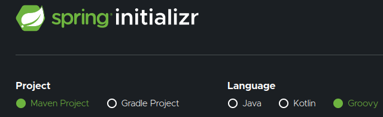
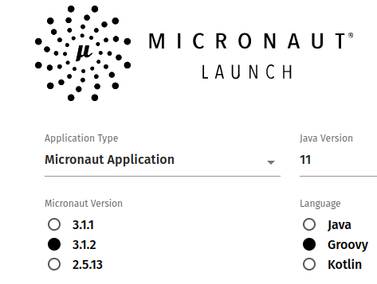
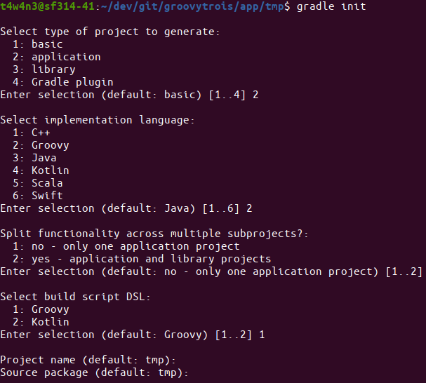
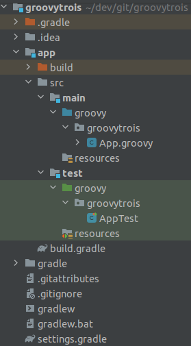

<!---
À qui je m'adresse :
* Les développeurs Java qui ne connaissent pas du tout Groovy
* Les développeurs Java qui connaissent un peu Groovy (ex : Jenkins), mais n'ont jamais essayé/envisagé de l'utiliser en prod
* Les développeurs d'autres langages qui ont besoin d'un langage de script

C'est quoi l'objectif de l'article :
1. Convaincre que Groovy permet de coder vite (et plus vite qu'en Java)
2. Convaincre qu'on peut utiliser Groovy en production
3. Convaincre qu'on peut ajouter Groovy dans un projet existant facilement et sans risque (interopérabilité/compatibilité avec Java)
4. Convaincre que le langage est intuitif et facile à apprendre
5. Donner envie de proposer Groovy à sa team demain matin
--->

## I. Intro

"Développeur/euse Java" ça ne serait pas un peu réducteur en fait ?

Ce n'est pas du Java qui tourne sur nos serveurs, nos smartphones.

Et non, c'est bien du bytecode.

On peut le générer avec plusieurs langages :

* Java (no kidding)
* Groovy
* Kotlin
* Scala
* Clojure
* JRuby
* Jython

Le bytecode généré est inter-compatible quel que soit son langage d'origine.

Cela signifie qu'une application Java peut avoir des classes dans un de ces langages, et elles peuvent toutes s'appeler entre elles.

On retrouve souvent ces langages parallèles dans des outils liés au test, à de la configuration et à l'automatisation :

* Groovy dans Spock, Jenkins, Gradle, Geb, Soap UI
* Scala dans Gatling
* Kotlin dans Gradle

Et on peut parfaitement les utiliser dans du code de production, ce que j'ai fait pendant presque 2 ans par le biais du framework Grails (Groovy On Rails). J'avais trouvé ce langage très efficace en termes de productivité et d'intelligibilité.

Cet article présente les fonctionnalités de Groovy (3.0.12) pour coder ses idées à toute vitesse.

## II. Les facettes de Groovy

Voici les caractéristiques et principes qui d’après moi, permettent à Groovy d’être si efficace :

### Facette 1 : Une courbe d’apprentissage plate

La transition Java vers Groovy se fait très facilement.

Pourquoi ?

Une ligne Java compile aussi en Groovy.

Et oui, on peut donc apprendre Groovy **itérativement** depuis du Java.

De nombreuses simplifications de code sont alors proposées par l'IDE et permettent de découvrir les fonctionnalités du langage.

### Facette 2 : Des conventions plutôt que de la configuration

Admettons-le, configurer c’est lourd. C’est surtout dans le design et l’écriture du code métier qu’on souhaite dépenser
notre précieux temps.

C’est probablement pour cette raison que les frameworks Springboot et Micronaut sont si appréciés ; ils appliquent ce
concept.

**Voici ma sélection de 10 fonctionnalités Groovy qui soutiennent le principe de "convention-over-configuration" :**

#### Fonctionnalité 1 : Plus besoin de point virgule

Attendez, je le répète.

**Plus besoin de point virgule**

C’est une étape décisive pour l’obtention d’un code avec une meilleure charge utile.

#### Fonctionnalité 2 : Littéraux de `List` et de `Map`

Si je devais citer une seule fonctionnalité de Groovy, ce serait celle-ci. Déclarer et initialiser des `Collection` et des `Map`en java est très verbeux.

Comparez vous-même pour une `ArrayList` (mutable) :

Java :

```java
var utilisateurs = new ArrayList<>() {{
	add(utilisateur1);
	add(utilisateur2);
}};
```

Je suis sympa, c’est du Java 11, ce qui nous économise le type. Sinon ça aurait été pire.

Groovy :

```groovy
var utilisateurs = [
	utilisateur1,
	utilisateur2,
]
```

Par **convention**, `utilisateurs` est une `ArrayList`. Mais on aurait pu avoir un autre type de `Collection`,
voire un `array` :

```groovy
Utilisateur[] utilisateurs = [
	utilisateur1,
	utilisateur2,
].toArray()

LinkedList<Utilisateur> utilisateurs = [
	utilisateur1,
	utilisateur2,
] as LinkedList

Set<Utilisateur> utilisateurs = [
	utilisateur1,
	utilisateur2,
].toSet()

var utilisateurs = [
	utilisateur1,
	utilisateur2,
].asImmutable()
```

Même chose pour les littéraux de map, dont voici la comparaison de syntaxe Java vs Groovy :

En Java (et à grand renfort d’imports statics) :

```java
import static java.util.Map.entry;
import static java.util.Map.ofEntries;

var utilisateurParGroupe = ofEntries(
	entry(groupe4,utilisateur1),
	entry(groupe2,utilisateur2)
	);
```

Là aussi, on est très content du type dynamique, à partir de Java 11.

Mais en Groovy, c’est bouilli à la plus pure charge utile :

```groovy
var utilisateurParGroupe = [
	(groupe4): utilisateur1,
	(groupe2): utilisateur2,
]
```

Aucun caractère n’est superflu. Même les parenthèses de clés sont bien de la charge utile, car elles indiquent que la
clé est une instance d’objet et non la `String` `"groupeX"`.

#### Fonctionnalité 3 : Default getters and setters

Les getters et setters sont facultatifs et ajoutés implicitement sur tous les champs avec le scope par défaut (empty),
comme avec les data-classes/value-classes Lombok.

```groovy
class Foo {
    int id
}

var foo = new Foo(id: 1)
assert foo.getId() == 1
```

#### Fonctionnalité 4 : Les affectations sont des alias des setters

```groovy
foo.id = 2
// Dans le bytecode c'est foo.setId(2) qui est appelé
```

Regardez, si on surcharge le `setId` par défaut et qu’on y place un breakpoint, ce code y passe.



#### Fonctionnalité 5 : Les récupérations sont des alias des getters

```groovy
foo.id = 2
// Dans le bytecode c'est foo.getId() qui est appelé
```

Il est aussi surchargeable.

#### Fonctionnalité 6 : Un constructeur par défaut avec des paramètres nommés

```groovy
class Utilisateur {
    int id
    String nom
}

var utilisateur = new Utilisateur(id: 1, nom: 'foo')
```

Ici, les attributs sont publics par défaut, et Groovy devine donc qu'il faut un constructeur avec eux.

De plus, je trouve que pouvoir nommer les paramètres et ainsi les mettre dans l'ordre souhaité manque à Java. 

#### Fonctionnalité 7 : Des arguments de méthode par défaut

Les paramètres de méthodes peuvent avoir une valeur par défaut et ainsi être facultatifs :

```groovy
String run(String param1, int param2 = 0) {
    println "$param1 + : $param2"
}

run('Fizz', 8) == 'Fizz : 8'
run('Fizz') == 'Fizz : 0'
```

On a alors économisé l'écriture de la méthode `run(String param1)`.

#### Fonctionnalité 8 : Le scope par default est `public`

Plus besoin de spécifier le scope public :



L’IDE nous l’indique d’ailleurs en le grisant.

#### Fonctionnalité 9 : Default obvious imports

Plus besoin des imports évidents, ils sont faits implicitement :

- java.lang.\*
- java.util.\*
- java.io.\*
- java.net.\*
- groovy.lang.\*
- groovy.util.\*
- java.math.BigInteger
- java.math.BigDecimal

#### Fonctionnalité 10 : Manipuler des `File` devient simple

Récupérer le contenu texte d’un fichier ? Trop facile. Écrire du texte dans un fichier ? Pareil.

```groovy
var file = new File("src/main/resources/one.tmpl")
var textContent = file.text
textContent += '''
final line
'''
file << textContent // 
```

L'opérateur `<<` est un alias vers `file.write(textContent)`.

En Java c'est un poil plus verbeux :

```java
var path = Paths.get("src/main/resources/one.tmpl");
var textContent = Files.readAllLines(path).join("\n")
byte[] strToBytes = "final line".getBytes();
Files.write(path, strToBytes);
```

En parlant d'opérateurs...

### Facette 3 : Des opérateurs de haut niveau d’abstraction

Groovy est inspiré de Python et Ruby pour ses opérateurs, dont voici mes 7 petits préférés :

#### 1.) Le Spread operator `*.`

Il permet d’invoquer une action sur tous les éléments d’une `List` disposant de cette action.

```groovy
class Utilisateur {
    void sendMessage(String message) {
        queue.send(this, message)
    }
}

utilisateurs*.sendMessage('unsubscribe')
```

Ici, chaque `Utilisateur` envoie le message.

En Java, ça aurait donné :

```java
utilisateurs.forEach(utilisateur -> utilisateur.sendMessage("unsubscribe"));
```

#### 2.) L’equal operator `==`

> Oui et alors, on a aussi un equal-equal en java, non ?

Oui, mais dans le cas de Groovy, si un `.equals(Object obj)` est présent dans la classe, alors cet opérateur en sera un alias. La comparaison de 2 instances similaires sera true en Groovy (false en Java), ce qui est plus intuitif quant au mot.

```groovy
import groovy.transform.EqualsAndHashCode

@EqualsAndHashCode
class Foo {
    Integer a
}

var one = new Foo(a: 1)
var two = new Foo(a: 1)
assert one == two
```

C'est effectivement plus intuitif.

L’égalité de java est transférée sur l’opérateur `===` (on ne voudrait pas perdre une fonctionnalité tout de même).

#### 3.) L'Elvis operator `?:`

Il permet d’affecter une valeur par défaut si l’élément de gauche est `false` (`null`, zéro et vide sont `false` en Groovy).

On évite alors les ennuyants ternaires du genre
`displayName = utilisateur.nom ? utilisateur.nom : 'Anonymous'`. Les `Optional` deviennent ainsi beaucoup moins nécessaires pour la
null-safety.

```groovy
displayName = utilisateur.nom ?: 'Anonymous'
```

`utilisateur` peut être `null` ? No problem, on en vient donc aux safe-operators

#### 4.) Les Safe-operators `?.` et `?[]`

Le premier est le "safe navigation op" et le 2ᵉ est le "safe index op". Ils permettent tous deux d’éviter les
'NullPointerException'.

```groovy
var displayName = utilisateur?.nom ?: 'Anonymous'
var secondBook = utilisateur?.books ?[1] ?: Book.prototype
```

Avec seuls trois opérateurs, on traite tous les cas de nullité possibles et le one-liner se comprend très bien.

#### 5.) Elvis-assignment-operator `?=`

Vous avez besoin d’éviter à tous pris la nullité d’une variable ? Initialisez-la seulement quand elle est effectivement
`null` avec l’elvis-assignment-op :

```groovy
var utilisateurDto = utilisateurRestRepository.get('123')
utilisateurDto.nom ?= 'John Smith'
```

Avec tous les op de null-safety, le principe de convention-over-configuration prend tout son sens.

#### 6.) Range operator `..`

On peut créer des plages d’entiers ou de char et itérer dessus directement :

```groovy
('a'..'g').each { println it } // prints a b c d e f g
(1..5).each { println it } // prints 1 2 3 4 5
```

On peut aussi se servir des `range` pour sublister une collection :

```groovy
[1, 2, 3, 4, 5][3..-1] == [4, 5]
[1, 2, 3, 4, 5][0..3] == [1, 2, 3, 4]
```

#### 7.) Spaceship operator `<=>`

C’est un alias de `.compareTo()`

```groovy
assert ('a' <=> 'd') == -1
assert ('a' <=> 'a') == 0
assert ('g' <=> 'a') == 1
```

### Facette 4 : Des high order functions natives sur les structures de données

L’activité probablement la plus récurrente dans un backend, est de manipuler des structures de données.

Les api Function et Stream ont révolutionné cette pratique. Mais l’intelligibilité est encore limitée par la verbosité de
Java.

Voyez plutôt :

```groovy
var entiers = [1, 2, 3]

//collectEntries (convert list to map)
Map<Integer, Utilisateur> utilisateurParId = entiers.collectEntries { [(it): utilisateurRepository.findById(it)] }

//groupBy
entiers.groupBy { it > 2 } == [false: [1, 2], true: [3]]

//split
entiers.split { it > 2 } == [[3], [1, 2]]

//average
entiers.average() == 2

//min with closure
var utilisateurAvecBalanceMin = entiers.min { utilisateurRepository.findById(it)?.balance }

//intersection
entiers.intersect([3, 4, 5]) == [3]

//indexation
entiers.indexed == [0: 1, 1: 2, 2: 3]

//combinations
[[1, 2], ['a', 'b']].combinations() == [[1, a], [2, a], [1, b], [2, b]]

//permutations
entiers.permutations() == [[1, 2, 3], [3, 2, 1], [2, 1, 3], [3, 1, 2], [1, 3, 2], [2, 3, 1]]

//collate (partitionner)
(1..10).collate(3) == [[1, 2, 3], [4, 5, 6], [7, 8, 9], [10]]
```

Et je ne m’arrête pas, car je suis à court, mais parce que vous avez saisi l’idée : toute opération de transformation
existe nativement dans Groovy, et les mixer entre elles donne des possibilités infinies tout en conservant une
lisibilité accrue.

## III. Intégrer Groovy dans un projet Java existant

Il faut configurer la "joint-compilation", pour compiler le Java et le Groovy. L’idéal est d’utiliser **Gmavenplus** :

```xml

<plugin>
	<groupId>org.codehaus.gmavenplus</groupId>
	<artifactId>gmavenplus-plugin</artifactId>
	<version>1.13.1</version>
	<executions>
		<execution>
			<goals>
				<goal>execute</goal>
				<goal>addSources</goal>
				<goal>addTestSources</goal>
				<goal>generateStubs</goal>
				<goal>compile</goal>
				<goal>generateTestStubs</goal>
				<goal>compileTests</goal>
				<goal>removeStubs</goal>
				<goal>removeTestStubs</goal>
			</goals>
		</execution>
	</executions>
	<dependencies>
		<dependency>
			<groupId>org.codehaus.groovy</groupId>
			<artifactId>groovy-all</artifactId>
			<version>3.0.12</version>
			<scope>runtime</scope>
			<type>pom</type>
		</dependency>
	</dependencies>
</plugin>
```

Si votre prod n'est pas prête à accueillir Groovy, peut-être que votre stack de test l'est. Il suffit alors de configurer la joint-compilation Gmavenplus en scope test uniquement avec `<scope>test<scope>`.

## IV. Démarrer un projet Groovy from scratch

Plusieurs solutions s’offrent à nous :

### 1.) Grails (Groovy on Rails)

C’est un framework du même créateur et maintenu par le même société
(Object Computing)

```shell
grails create-app myApp
cd myApp
grails run-app
```

### 2.) Springboot

Le spring initializr permet de générer un projet groovy.



### 3.) Micronaut

Idem avec le Micronaut sarter



### 4.) Gradle

On peut aussi faire des applications Groovy pur depuis Gradle :

```shell
sdk use gradle 7.5.1
mkdir demo && cd demo
gradle init
```



Ce qui nous donne cette jolie app Gradle avec une entrypoint class `App` :



## Conclusion

Java est un langage verbeux et contraint dans son évolution par le souci de rétrocompatibilité.  
C'est là que Groovy intervient : il offre une meilleure expressivité et les fonctionnalités des langages modernes, tout ça en restant compatible avec la plateforme JVM.  
Ce langage est déjà utilisé dans des outils du marché, et commence à pointer le bout de son nez en production dans les applications métier.  
Il est maintenu par des grands noms du monde Java : Guillaume Laforge, Cedric Champeau, ... et fait partie de l'Apache Software Foundation, ce qui donne confiance dans sa stabilité en production.

Aujourd'hui Groovy existe en version 4, dont l'adoption par les outils et framework se poursuit.  
Les fonctionnalités que je présente ici n'y sont pas révolutionnées, mais le parsing et la compilation y ont été revues, entrainant le breaking-change de cette version 4.  
Springboot 2.7.3 et Micronaut 3.6.1 ont déjà sauté le pas de la version 4.

Sauter le pas dans vos propres projets (avec une suite de tests convenable) leur apportera productivité et fun.
