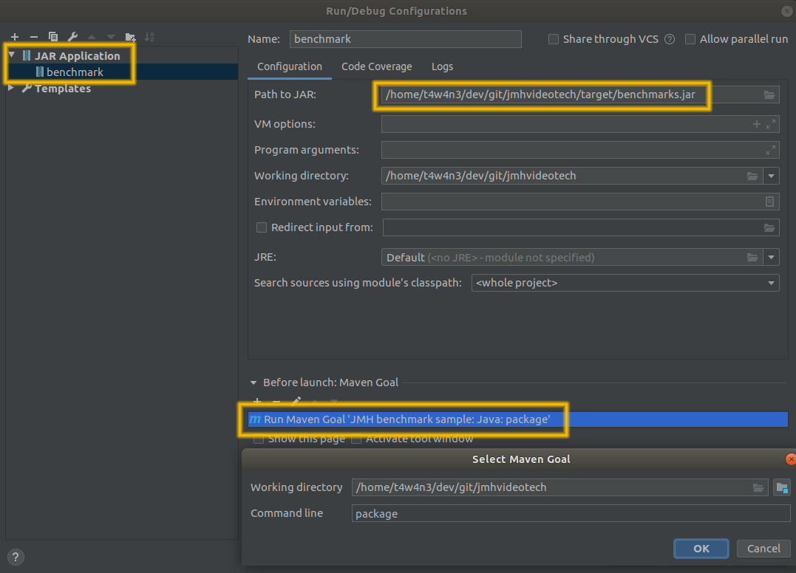
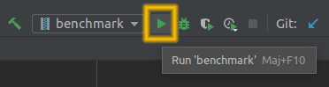

Orienter ses choix techniques en Java avec le microbenchmarking
===============================================================
Pour s'adapter au changement dans le monde du logiciel, on souhaite réduire les boucles de feedback.  
Et c'est alors que :
* Les codes review deviennent du pair programming
* Les cahiers des charges deviennent des Epics, avec des User Story et des critères d'acceptation
* La couverture de code devient du TDD
* La recette devient du test d'acceptation

## Once upon a time
Très bien, la PO Estelle a alors spécifié une superbe User Story, avec des critères d'acceptation en Gherkin.  
Benjamin et Bertrand l'ont développé en pair programming.  
Ils ont commencé par développer :
* des tests end-to-end
* des tests d'intégration
* des bouchons pour les endpoints
* des tests d'acceptation

Et enfin ils ont développé les tests unitaires et le code de production en TDD.


### Ducks everywhere
Voici comment ils ont décidé de faire quacker tous les canards jaunes dans le `DuckService` :

```Java
    public void makeAllYellowDucksQuack() {
        filterAllYellowDucksThen().forEach(makeItQuack);
    }

    private Stream<Duck> filterAllYellowDucksThen(){
        return iterateAllDucksThen().filter(yellowDucks);
    }

    private static Consumer<Duck> makeItQuack = Duck::quack;

    private Stream<Duck> iterateAllDucksThen() {
        return ducks.stream();
    }

    private static Predicate<Duck> yellowDucks = Duck::isYellow;
```

Après quelques itérations, la PIC<sup>[^1]</sup> finit par indiquer que 100% des tests passent : le [DoD](https://www.leadingagile.com/2017/02/definition-of-done/) est rempli.

### Delivery time
La branche de feature est alors livrée au bencheur.

Il charge des data (anonymysées) dans sa base de données avec une volumétrie indiquée par le PO.

### Verdict time
Le verdict tombe, il y a un point de contention au niveau de la méthode `makeAllYellowDucksQuack()`.
Le rapport est transmis à la dev-team, et la feature repart en fabrication.

Que d'efforts d'adaptation, pour au final se prendre un bon vieux tunnel.  


Attention image non libre de droit. Vérifier si on peut se le permettre.

### Reflection time
Sans pour autant affirmer qu'on devrait se passer du bench, je vous annonce que là aussi on peut réduire la boucle de feedback en ce qui concerne les choix techniques, liés, entres autres, à la volumétrie !

Suivez bien comment va s'y prendre notre binome.

## MicroBenchmarking

Tout comme la couverture unitaire rend une application plus stable dans sa globalité : le benchmark unitaire peut la rendre plus performante.

### Dans le vif du sujet : JMH

>JMH is a Java harness for building, running, and analysing nano/micro/milli/macro benchmarks written in Java and other languages targetting the JVM.

#### Requirements

**Attention à bien utiliser un JDK avec une JVM HotSpot[^2]**  
Les résultats produits avec une autre JVM peuvent ne pas être fiables :

Extrait d'un benchmark avec une JVM OpenJ9[^3] :
```
# VM version: JDK 1.8.0_242, Eclipse OpenJ9 VM, openj9-0.18.1
# *** WARNING: This VM is not supported by JMH. The produced benchmark data can be completely wrong.
WARNING: Not a HotSpot compiler command compatible VM ("Eclipse OpenJ9 VM-1.8.0_242"), compilerHints are disabled.
```

#### Ajout des dépendances

Pour des résultats plus fiables, [openjdk](https://openjdk.java.net/projects/code-tools/jmh/#Basic%20Considerations) recommande de créer les benchmarks dans un projet dédié :
>[...] setup a standalone project that depends on the jar files of your application

##### Maven

Ils créent donc un nouveau projet de benchmark avec l'archetype maven :
```bash
mvn archetype:generate \
    -DinteractiveMode=false \
    -DarchetypeGroupId=org.openjdk.jmh \
    -DarchetypeArtifactId=jmh-java-benchmark-archetype \
    -DarchetypeVersion=1.23 \
    -DgroupId=fr.younup.benchmark \
    -DartifactId=quackquack
```

Exraits du pom.xml :
```xml
<dependency>
    <groupId>org.openjdk.jmh</groupId>
    <artifactId>jmh-core</artifactId>
    <version>${jmh.version}</version>
</dependency>
<dependency>
    <groupId>org.openjdk.jmh</groupId>
    <artifactId>jmh-generator-annprocess</artifactId>
    <version>${jmh.version}</version>
    <scope>provided</scope>
</dependency>
```
```xml
<properties>
    <project.build.sourceEncoding>UTF-8</project.build.sourceEncoding>
    <jmh.version>1.23</jmh.version>
    <javac.target>1.8</javac.target>
    <uberjar.name>benchmarks</uberjar.name>
</properties>
```
```xml
<plugin>
    <groupId>org.apache.maven.plugins</groupId>
    <artifactId>maven-compiler-plugin</artifactId>
    <version>3.8.0</version>
    <configuration>
        <compilerVersion>${javac.target}</compilerVersion>
        <source>${javac.target}</source>
        <target>${javac.target}</target>
    </configuration>
</plugin>
<plugin>
    <groupId>org.apache.maven.plugins</groupId>
    <artifactId>maven-shade-plugin</artifactId>
    <version>3.2.1</version>
    <executions>
        <execution>
            <phase>package</phase>
            <goals>
                <goal>shade</goal>
            </goals>
            <configuration>
                <finalName>${uberjar.name}</finalName>
                <transformers>
                    <transformer implementation="org.apache.maven.plugins.shade.resource.ManifestResourceTransformer">
                        <mainClass>org.openjdk.jmh.Main</mainClass>
                    </transformer>
                    <transformer implementation="org.apache.maven.plugins.shade.resource.ServicesResourceTransformer"/>
                </transformers>
                <filters>
                    <filter>
                        <artifact>*:*</artifact>
                        <excludes>
                            <exclude>META-INF/*.SF</exclude>
                            <exclude>META-INF/*.DSA</exclude>
                            <exclude>META-INF/*.RSA</exclude>
                        </excludes>
                    </filter>
                </filters>
            </configuration>
        </execution>
    </executions>
</plugin>
```
Le plugin Maven `shade` permet de packager tout le projet **et ses dépendances** dans un uber-jar.
>An uber-jar is an "over-jar", one level up from a simple JAR, defined as one that contains both your package and all its dependencies in one single JAR file.

[Source](https://stackoverflow.com/a/11947093)  
[Documentation](http://maven.apache.org/plugins/maven-shade-plugin/)

Ils ajoutent la dépendance vers leur projet :
```xml
<dependency>
   <groupId>fr.younup</groupId>
   <artifactId>quackquack</artifactId>
   <version>1.0</version>
</dependency>
```

#### Gradle

Il est également possible d'utiliser JMH dans un projet Gradle.  
https://github.com/melix/jmh-gradle-plugin

### Hello World

Ils effectuent un smoke-test de leur conf avec un Hello World :
```java
public class MyBenchmark {

    @Benchmark
    public String helloWorldBenchmark() {
        return "Hello World";
    }
}
```

#### First run !

Command line :
```
mvn package
java -jar target/benchmarks.jar
```

Et avec IntelliJ (et Eclipse), on peut lancer le jar en `Run Configuration`, avec la step de packaging en `Before launch` :



C'est parti !



#### Analysons le rapport avec eux
```
# Warmup: 5 iterations, 10 s each
# Measurement: 5 iterations, 10 s each
# Timeout: 10 min per iteration
# Threads: 1 thread, will synchronize iterations
# Benchmark mode: Throughput, ops/time
# Benchmark: fr.younup.MyBenchmark.helloWorldBenchmark
```
Une synthèse des paramètres (ici ceux par défaut) :
* Une **itération** signifie "looper sur le benchmark autant de fois qu'il est possible dans le temps imparti pour chaque itération"
* Le **warmup** est une étape de stabilisation du système, où les résultats ne sont pas comptabilisés
* Le **Benchmark mode** indique l'unité des résultats, ici en opération/seconde
* Les **ops** (operations) sont le nombre de fois que sont exécutées les fonctions de benchmark annotées.

```
# Run progress: 0,00% complete, ETA 00:08:20
# Fork: 1 of 5
# Warmup Iteration   1: 173299771,520 ops/s
# Warmup Iteration   2: 173048557,050 ops/s
# Warmup Iteration   3: 203116377,327 ops/s
# Warmup Iteration   4: 203426633,927 ops/s
# Warmup Iteration   5: 200113928,777 ops/s
Iteration   1: 199441166,100 ops/s
Iteration   2: 203273185,356 ops/s
Iteration   3: 203443620,476 ops/s
Iteration   4: 200002433,027 ops/s
Iteration   5: 204119799,321 ops/s
```
Un **Fork** de benchmark permet de le répéter dans des sous-process isolés, afin de se rapprocher du contexte de prod en ce qui concerne le cpu, le compilateur JIT, le GC, les caches mémoires, et j'en oubli très certainement.

Il semble que le benchmark compte faire 5 forks. Voyons déjà ce que les log du 1er nous apprennent :
* Leur système parvient à faire environ 200 millions de Hello World par seconde !
* On voit que 2 étapes de warmup semblent suffire à stabiliser

Et si vous tenez vraiment aux 4 forks restants :
 resize it smaller please :)

La synthèse des 5 forks :

```
Result "fr.younup.MyBenchmark.helloWorldBenchmark":
  200953085,031 ±(99.9%) 1464321,134 ops/s [Average]
  (min, avg, max) = (196712422,268, 200953085,031, 204119799,321), stdev = 1954826,820
  CI (99.9%): [199488763,897, 202417406,165] (assumes normal distribution)
```
Le rapport donne ici :
* La moyenne d'opération par seconde (200 953 085)
* La variance (1 464 321)
* La distribution

À chacun d'en tirer les conclusions spécifiques à son contexte.

```
# Run complete. Total time: 00:08:21
```
---
À lire attentivement **au moins** 1 fois :
```
REMEMBER: The numbers below are just data. To gain reusable insights, you need to follow up on
why the numbers are the way they are. Use profilers (see -prof, -lprof), design factorial
experiments, perform baseline and negative tests that provide experimental control, make sure
the benchmarking environment is safe on JVM/OS/HW level, ask for reviews from the domain experts.
Do not assume the numbers tell you what you want them to tell.
```
>C'est pas faux !

En résumé : prenez les résultats avec des pincettes et méfiez vous du [biais de confirmation](https://www.youtube.com/watch?v=6cxEu-OP5mM).

---
```
Benchmark                         Mode  Cnt          Score         Error  Units
MyBenchmark.helloWorldBenchmark  thrpt   25  200953085,031 ± 1464321,134  ops/s
```
Et pour finir, on a une synthèse des benchmark effectués dans ce run (ici 1 seul).  
On notera que la moyenne est nommée "Score", et que la variance est nommée "error".  
On notera aussi que le "Cnt" (Count) correspond à nb_fork * nb_iteration.

### Tweaking params

Pour diminuer la variance, le temps d'exécution, ou si les paramètres par défaut ne conviennent pas au contexte, on peut utiliser, entre autres, ces annotations et leurs paramètres :

```java
public class MyBenchmark {

    @Fork(value = 1)
    @BenchmarkMode(Mode.AverageTime)
    @Warmup(iterations = 3, time = 4)
    @Measurement(iterations = 3, time = 4)
    @OutputTimeUnit(TimeUnit.NANOSECONDS)
    @Benchmark
    public String helloWorldBenchmark() {
        return "Hello World";
    }
}
```
Pour plus de précisions sur les params des annotations, je vous invite à visiter leurs interfaces dans les [sources](https://hg.openjdk.java.net/code-tools/jmh/file/24b3c89b5332/jmh-core/src/main/java/org/openjdk/jmh/annotations) de JMH.

#### Voyons l'incidence des annotations dans le rapport

```
# Fork: 1 of 1
# Warmup Iteration   1: 2,911 ns/op
# Warmup Iteration   2: 2,961 ns/op
# Warmup Iteration   3: 2,552 ns/op
Iteration   1: 2,513 ns/op
Iteration   2: 2,523 ns/op
Iteration   3: 2,503 ns/op
Result "fr.younup.MyBenchmark.helloWorldBenchmark":
  2,513 ±(99.9%) 0,188 ns/op [Average]
  (min, avg, max) = (2,503, 2,513, 2,523), stdev = 0,010
  CI (99.9%): [2,325, 2,701] (assumes normal distribution)
# Run complete. Total time: 00:00:24
MyBenchmark.helloWorldBenchmark  avgt    3  2,513 ± 0,188  ns/op
```

Je trouve que l'unité seconde/opération est souvent plus parlante.  
C'est ce que permet le mode `AverageTime`.</br>

### Benchmark du code de prod

```java
public class MyBenchmark {

    @State(Scope.Benchmark)
    public static class MyState {

        public DuckService duckService = new DuckService();
        public DuckFactory duckFactory = new DuckFactory();

        public MyState() {
            duckService.ducks = duckFactory.createDucksWithRandomColors(100);
        }
    }

    @Fork(value = 1)
    @BenchmarkMode(Mode.AverageTime)
    @Warmup(iterations = 2)
    @Measurement(iterations = 2)
    @OutputTimeUnit(TimeUnit.MICROSECONDS)
    @Benchmark
    public void makeAllYellowDucksQuackWithStreamBenchMark(MyState myState) {
        myState.duckService.makeAllYellowDucksQuack();
    }
}
```

#### Le Jeu de données

L'étape d'instanciation du JDD ne doit pas être comptabilisée dans le bench.  
On le génère donc dans une classe (statique ou pas) annotée de `@State`.  
Le scope se limite aux méthodes de benchmark, ou aux threads (forks).  
Cela signifie qu'entre le benchmark de la méthode `makeAllYellowDucksQuackWithStreamBenchMark` et celui de la méthode `makeAllYellowDucksQuackWithStreamBenchMark`, l'état (`State`) sera ré-instancié marlgré sa nature static.

/!\ Attention aux JDD randomisés !

Ici la méthode `createDucksWithRandomColors()` n'est donc pas vraiment random.  
Elle est [idempotente](https://fr.wikipedia.org/wiki/Idempotence). Elle créé toujours le même JDD depuis un fichier CSV.  
Le csv, lui, contient un JDD randomisé.  
Ce n'est pas le sujet ici, mais je vous donne une implémentation grossière (et efficace) :
```java
public List<Duck> createDucksWithRandomColors(int number) {
    List<Duck> collect = IntStream.range(0, number).mapToObj(i -> new Duck()).collect(toList());
    List<Integer> yellowDucksIndexes = new ArrayList<>();
    /* Contient une liste ordonnée d'entiers uniques aléatoires entre 0 et 1_000_000.
       Ils représentent les index des canards qui doivent être jaunes.*/
    File file = new File("src/main/resources/yellowDucksIndexes.csv");
    try (Scanner scanner = new Scanner(file)) {
        String nextLine;
        while (scanner.hasNextLine()) {
            nextLine = scanner.nextLine();
            yellowDucksIndexes.add(Integer.parseInt(nextLine));
        }
    } catch (Exception e) {

    }
    for (int i = 0; i < number; i++) {
        try {
            collect.get(yellowDucksIndexes.get(i)).color = Color.Yellow;
        } catch (Exception e) {
            break;
        }
    }
    return collect;
}
```

Le résultat pour 100 canards :
```
100:
Benchmark                                          Mode  Cnt        Score   Error  Units
MyBenchmark.filterYellowDucksWithStreamBenchmark   avgt    2    47462,131          us/op
```

Et pour d'autres tailles d'élevage :

| Taille élevage | Quacking time | Quacking time by duck |
|:--------------:|:-------------:|:---------------------:|
|        5       |      5667     |        1133,40        |
|       10       |      7116     |         711,60        |
|       100      |     47462     |         474,62        |
|      1000      |     623488    |         623,49        |
|      10000     |    5714675    |         571,47        |


Un quack mettant environ 1ms, on note que la compilation JIT a économisé pas mal d'instructions sur les longues listes.

### stream vs forLoop vs parallelStream

Voyons les performances d'autres implémentations de quacking :

```Java
public void makeAllYellowDucksQuackWithForLoop() {
    for (Duck duck : ducks) {
        if (duck.isYellow()){
            duck.quack();
        }
    }
}
public void makeAllYellowDucksQuackWithParallelStream() {
    ducks.parallelStream().filter(yellowDucks).forEach(makeItQuack);
}
```
```java
    @State(Scope.Benchmark)
    public static class MyState {
        public DuckService duckService = new DuckService();
        public DuckFactory duckFactory = new DuckFactory();
        {
            duckService.ducks = duckFactory.createDucksWithRandomColors(100);
        }
    }

    @Fork(value = 1)
    @BenchmarkMode(Mode.AverageTime)
    @Warmup(iterations = 2)
    @Measurement(iterations = 2)
    @OutputTimeUnit(TimeUnit.MICROSECONDS)
    @Benchmark
    public void filterYellowDucksWithForLoopBenchmark(MyState myState) {
        myState.duckService.makeAllYellowDucksQuackWithForLoop();
    }
    
    @Fork(value = 1)
    @BenchmarkMode(Mode.AverageTime)
    @Warmup(iterations = 2)
    @Measurement(iterations = 2)
    @OutputTimeUnit(TimeUnit.MICROSECONDS)
    @Benchmark
    public void filterYellowDucksWithParallelStreamBenchmark(MyState myState) {
        myState.duckService.makeAllYellowDucksQuackWithParallelStream();
    }
```

```
Benchmark                                          Mode  Cnt        Score   Error  Units
MyBenchmark.filterYellowDucksWithForLoopBenchmark  avgt    2    47650,604          us/op
MyBenchmark.filterYellowDucksWithParallelStream    avgt    2     7303,440          us/op
MyBenchmark.filterYellowDucksWithStreamBenchmark   avgt    2    47462,131          us/op
```

L'implementation `filterYellowDucksWithParallelStream` semble être plus performante.
Voyons pour des tailles d'élevages différentes :

| Taille élevage | Quacking time | Quacking time by duck |
|:--------------:|:-------------:|:---------------------:|
|        5       |      1902     |         380,40        |
|       10       |      1731     |         173,10        |
|       100      |      7303     |         73,03         |
|      1000      |     84254     |         84,25         |
|      10000     |     740131    |         74,01         |

Même pour seulement 5 canards, le temps d'inititalisation du stream et les temps de fork/merge du thread-pool sont négligeables.  
/!\ Ca n'aurait pas été le cas pour un temps de quaking plus court !

### Conclusion

Grace aux microbenchmarks et JMH, ils savent qu'ils ont résolu leur problème de contention, avant même de renvoyer les correctifs au bencheur.

### Disclaimer on results

Les microbenchmarks révèlent effectivement que des implémentations sont plus efficaces que d'autres.
Cependant il faut toujours avoir en tête la volumétrie de production, afin de pouvoir répondre à la question :
**"Est-ce que ca vaut vraiment le cout de refactorer ?"**
Car il y a d'autres objectifs pour le code, entre autres :
* La lisibilité
* L'évolutivité
* Le modularité

Si le gain de temps est de quelques nanosecondes pour très peu d'itérations, on préferera conserver une implémentation plus simple, et/ou plus conpréhensible.  
En utilisant régulièrement JMH, on découvre que les for-loop sont très souvent plus rapides que leur équivalent fonctionnel, mais elles sont aussi très souvent plus complexes[^4] et/ou plus compliquées.  
Avant de re-factorer, on se re-pose alors les questions :
* **"Quelle est ma volumétrie ?"**
* **"Quelle est la latence max admissible ?"**

## Pour aller plus loin

### Benchmarks as test
En changeant le scope de la dépendance Maven JMH en `test`, on peut envisager d'asserter les résultats dans des TU.

Et donc, à suivre : "Benchmark As Unit-Test, asserting methods performances" ;)

### Java 12

JMH s'est imposé comme un standard du microbenchmarking en Java et a alors été intégré nativement dans Java 12, dans la [JEP 230](https://openjdk.java.net/jeps/230).

Et donc, à suivre : "MicroBenchmarks natif avec Java 12" ;)


[^1]: Plateforme d'Intégration Continue  
[^2]: HotSpot is the VM from the OpenJDK community. It is the most widely used VM today and is used in Oracle’s JDK. It is suitable for all workloads.  
[^3]: Eclipse OpenJ9 is the VM from the Eclipse community. It is an enterprise-grade VM designed for low memory footprint and fast start-up and is used in IBM’s JDK. It is suitable for running all workloads.  
[^4]: Complexe : Difficile à prédire.  
[^5]: Compliqué : Difficile à comprendre
