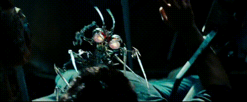

# Extraire des gif HQ de longues vidéos sans logiciel d'édition

Vous écrivez votre prochain article/talk tech, et une métaphore vous vient en tête !
Ça tombe bien, il était temps de faire un trait d'humour pour garder l'attention.

Vous avez une réplique de film bien précise en tête et vous aimeriez la coller, juste là.

## Exemple avec le concept "Découpage forcé"

L'image qui me vient, c'est le petit robot fourbe du film Transformers 2, quand il sort sa scie circulaire pour extraire le cerveau du personnage principal.  
Après quelques recherches, je découvre le nom de ce petit robot : Scalpel !  
Pas de gif à l'horizon :(

Peu importe, je vais me le créer en 2-2 !

Par chance, je trouve la scène en question sur [youtube](https://www.youtube.com/watch?v=9j7GRlbvXQ4).  
J'installe le plugin Firefox [VideoDownloadHelper](https://addons.mozilla.org/fr/firefox/addon/video-downloadhelper/), et je DL la scène en 720p.

## Je sors mon couteau suisse du son et de la vidéo : **ffmpeg**

```bash
sudo apt install ffmpeg
```
Des releases sont disponibles sur toutes les plateformes, et le code source est ouvert.  
[http://ffmpeg.org/download.html](http://ffmpeg.org/download.html)

Habituellement je l'utilise pour transformer des tracks audio en [Ogg Opus](http://opus-codec.org/static/comparison/quality.png) (my favorite audio codec). Bref.

### Raw command

```shell
ffmpeg -ss 1:21 -t 4 -i Scalpel.mp4 -vf "fps=20,crop=1280:530:0:100,scale=500:-1" -gifflags +transdiff -y output.gif
```

#### Cibler la séquence

* `-ss 1:21` pour commencer le gif à partir de 1 min 20
* `-t 4` pour ne prendre que les 4 secondes qui suivent

#### Indiquer le fichier d'entrée

`-i Scalpel.mp4`

#### Indiquer les frames par secondes

`-vf "fps=20"`

#### Redécouper la vidéo

Je souhaite retirer l'incrustation de la barre noire du bas.  
Je dois d'abord connaitre la taille de la vidéo d'origine :
```shell
ffprobe -v error -select_streams v:0 -show_entries stream=width,height -of csv=s=x:p=0 Scalpel.mp4
1280x720
```

Je retire 100 pixels en haut et en bas :
`-vf "crop=1280:520:0:100"`

##### Prévisualiuser les params de Découpage
`ffplay -i Scalpel.mp4 -vf "crop=1280:520:0:100"`

#### Redimensionner la vidéo (découpée) à 500 pixels de long

`-vf "scale=500:-1"`

#### La magie gif de ffmpeg

`-gifflags +transdiff`

Dans les `gifFlags` il y a, entre autres, le mode loop.

### Résultat




## Source
J'ai découvert cette feature de ffmpeg grâce à [cet article](http://blog.pkh.me/p/21-high-quality-gif-with-ffmpeg.html), qui explique, en plus, comment ffmpeg s'y prend pour avoir des gif HQ (changer la palette de couleur à chaque frame).
