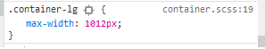
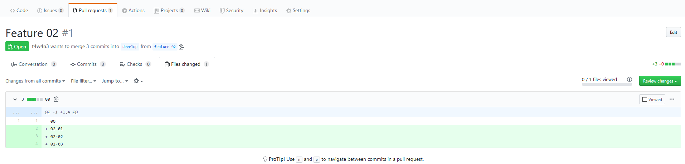
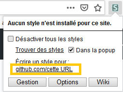
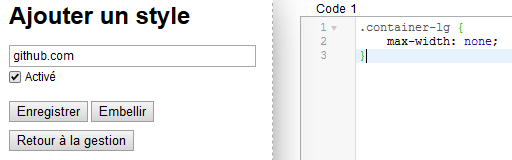
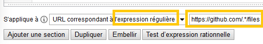

Des Pull-Request reviews plus facile dans Github
================================================

Quand on review une pull-request dans Github, l'onglet "files changed" nous montre les fichiers modifés.
Mais il les tronque à la même largeur que le reste de l'interface :(


De plus gros fichiers sont moins facile à reviewer.

## Le responsable :



## max-width: none;



Ahhhhh, on y voit plus clair :D

## Automatiser le change-style

Sous Firefox ou Chrome : Plugin Stylus

### Installation

](stylus_firefox.png)

](stylus_chrome.png)

* [Recommandé](https://support.mozilla.org/fr/kb/programme-extensions-recommandees#w_comment-les-extensions-recommandaees-sont-elles-saelectionnaees) par Mozilla
* [Open Source](https://github.com/openstyles/stylus)

### Configuration

1. New style



2. Style css code



```css
.container-lg {
    max-width: none;
}
```

3. Url matching



`https://github.com/.*/files`

4. Enregistrer

5. Tadaaaaa