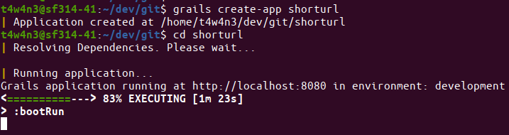
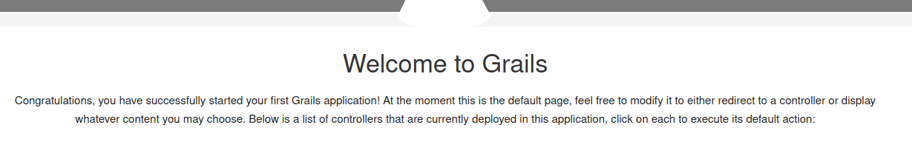
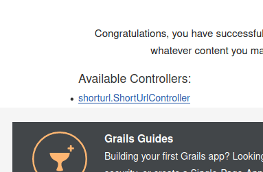
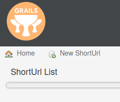
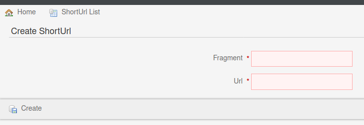
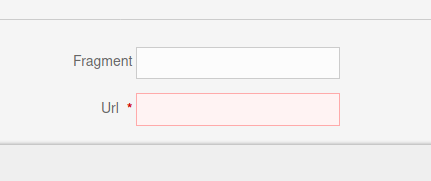
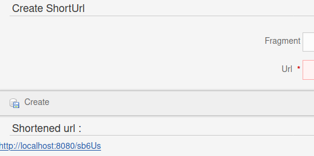

# Heroku + Grails : from idea to prod in 1 article

I recently (re-)discovered Heroku by watching [this video](https://www.youtube.com/watch?v=gq5yubc1u18) from the channel [Coding Garden](https://coding.garden/).

In this recorded live coding, he try (and success) to build an url-shortener website from scratch, and deploy it to production thanks to Heroku PAAS and its CLI, in 1 hour.

I was like :

> Waou, such mastery of his tools !

And I asked myself :

> Could I do the same with my own stack ?"

Let's try !

## The project

We will build a similar url shortener, where we can choose the url fragment.

The MVP is :

```
Given a form with
    * an optional field for the fragment
    * a mandatory field for the url to shorten

When we fill an url to shorten,

And we click on "create",

Then the shortened url appears,

When we click on it or we open it,

Then we are redirected to the target url.
```

## My stack

I'm a Java backend guy, who can also do some stuff on frontend.

And I hate wasting time on basic configuration when I just want something that works.

(Note that I don't say I hate configuration).

So when I heard about "Convention over Configuration", I quited JavaEE7/Weblogic/XML-everywhere, to embrace the Spring World.

But raw Springboot was not enough for me. I work on projects with pressured time-to-market, and Java is too verbose to achieve complex data structures with simple code (just try to init an immutable LinkedHashMap of function by predicate in any Java version ...).

Also, I don't seek for best performance code, but for best understandability code.

And then, I adopted Groovy (It could have been Kotlin as well maybe).

Springboot handle Groovy very well, but why stopping to Springboot ?

Is there a mature convention-over-configuration JVM framework that works smoothly with Groovy ?

Of course : Grails  !

## Requirements

* A JDK 15
* An Heroku account
* The [Heroku CLI](https://devcenter.heroku.com/articles/heroku-cli)
* Grails 4.1.0.M2 (or any other version >= 3.0.0, because they have Gradle)
* (optional) Intellij

If you have [sdkman](https://sdkman.io/) :

```sh
sdk install grails 4.1.0.M2
sdk install java 15.0.1-open
```

And if you don't have it, go get it :wink: :
```sh
curl -s "https://get.sdkman.io" | bash
source "$HOME/.sdkman/bin/sdkman-init.sh"
```

## Step 1 : Bare Grails project

First, we have to start the grails project :

```sh
grails create-app shorturl
cd shorturl
```

Let's see what we already have; by launching the dev mode :

```sh
./grailsw run-app
```
### run-app result :
> 

### Front-end caption :
> 

## Step 2 : Creating the main entity

Basically, what we want is to store `url` per `fragment`.

Let's create a domain class for that :

```sh
./grailsw create-domain-class shortUrl
```

We open it, and we create the attributes :

```groovy
class ShortUrl {

	String fragment
	String url

	static constraints = {
	}
}
```

See the  `constraints` field ?

We can add validation conditions for each field :

* The `fragment` :
  * Must be unique
  * Should have from 5 up to 10 chars
* The url :
  *  Must be a valid url
  *  Must not be blank

```groovy
static constraints = {
	fragment unique: true, size: 5..10,
	url url: true, blank: false
}
```

## Step 3 : Scaffold the ShortUrl entity

Now our domain is modeled, we can assume that every action a user can do in the frontend, is an aggregation of CRUD operations on the domain entities.

Luckily, we have only one entity, and the only CRUD operation available will be CREATE.

Building a frontend form for the CREATE operation is a wheel, and Grails knows we don't want to re-invent it.

And so he will scaffold it for us !

Grails implements [Micronaut for Spring](https://micronaut-projects.github.io/micronaut-spring), so we are working on a MVC.

The scaffold starts from a Controller. Let's create it :
```Groovy
class ShortUrlController {
	static scaffold = ShortUrl
}
```

Stooooop ! Don't reload the app ! Grails has already done it ;)

Just open the browser :

### Available controllers :
>

### Short-urls list page
>

### Short-url create page
>

## Step 4 : Change the index page

The CREATE view should be our index page, no ?

We can achieve this with `UrlMappings.groovy` (which already exists) :

```groovy
class UrlMappings {
    static mappings = {
        "/$controller/$action?/$id?(.$format)?"{
            constraints {
            }
        }

        "/"(controller: 'shortUrl', action: "create")
        "500"(view: '/error')
        "404"(view: '/notFound')
    }
}
```

When a user reach '/', he will be redirected to the 'create' action of the controller named 'ShortUrlController'.

> Which action you said ? There is no method in the ShortUrlController.

Yes, there are. The actions 'create', 'save', 'get', 'update' are injected at compile-time in the controller, thanks to the scaffolding ;)

## Step 5 : Forbid unwanted actions

```groovy
class UrlMappings {
    static mappings = {
        "/$controller/$action?/$id?(.$format)?"{
            constraints {
     	       controller matches: 'shortUrl'
        	    action inList: ['show', 'index', 'save']
            }
        }

        "/"(controller: 'shortUrl', action: "create")
        "500"(view: '/error')
        "404"(view: '/notFound')
    }
}
```

We also use the `constraints` closure to :

* Allow only the `ShortUrlController`

* Allow only the actions show, index, save

If the constraints validation failed, the user is redirected (by convention) to the 404 page.

## Step 6 : Make the fragment optional

Grails built the form based on the entity attributes type and constraints.

Let's make the fragment nullable :
```groovy
static constraints = {
    fragment unique: true, nullable: true
    url url: true, blank: false
}
```



Much better ^^

But, we now have to randomly generate one if not set.

Let's init it (if not user-provided) in the beforeValidate of ShortUrl :
```groovy
def beforeValidate() {
	fragment ?= UUID.randomUUID().toString().take(5)
}
```
The UUID is far too long, so we only take the 5 first chars.

------
### About Randomness

Here, the fragment doesn't have to be secure. We just want 5 chars words. Yes we will have collisions, and we will not address this low value problem now.

-----


## Step 7 : Change create redirection

> 

When we create a shorturl, by submitting the form, the 'save' action is run, and we are conventionally redirected to the show page of the created ShortUrl Entity.

It has no value in our MVP, so we prefer to be redirected to a new create page, with the new fragment into a conditional div.

Let's override the scaffolded implementation :

```sh
rm grails-app/controllers/shorturl/ShortUrlController.groovy
./grailsw generate-controller ShortUrl
```

The ShortUrlController is recreated with all the actions.

Don't forget to re-add the scaffold option : `static scaffold = ShortUrl`

Now we can change the behaviors to the default 'show' action :

```groovy
def show(Long id) {
    redirect action: 'create', params: [id: id]
}
```

We give the id of the created entity in parameter in order to be able to retrieve and display it on the create page.

## Step 8 : The conditional div on the create page

When we land on the create page, there are two use cases :

1. We just opened the page
1. We just submitted a new shortUrl on a previous create page

On the second case, we have a non-null `params.id`, so we fetch the associated entity from the database and we add it into the model, in order to make the entity available in the create view.

```groovy
def create(String id) {
    respond new ShortUrl(params), model: [created: ShortUrl.get(id)]
}
```

Now we override the create page by generating the 4 views (index, show, edit, create) :

```sh
./grailsw generate-all ShortUrl
```

At the end of the create.gsp body, we add the conditional div :

```html
[...]
</div>
<g:if test="${created}">

</g:if>
</body>
</html>
```

We can add it some code from the show.gsp:

```html
[...]
</div>
<g:if test="${created}">
	<div id="show-shortUrl" class="content scaffold-show" role="main">
		<h1>Shortened url :</h1>
		<g:if test="${flash.message}">
			<div class="message" role="status">${flash.message}</div>
		</g:if>
	</div>
</g:if>
</body>
</html>
```

Then we just show the link :
```html
[...]
</div>
<g:if test="${created}">
	<div id="show-shortUrl" class="content scaffold-show" role="main">
		<h1>Shortened url :</h1>
		<g:if test="${flash.message}">
			<div class="message" role="status">${flash.message}</div>
		</g:if>
        <g:set var="link" value="${createLink(uri: "/${created.fragment}", absolute: true)}"/>
        <a href="${link}">${link}</a>
	</div>
</g:if>
</body>
</html>
```
And we delete the un-overriden/un-used views :
```sh
rm grails-app/views/shortUrl/show.gsp
rm grails-app/views/shortUrl/index.gsp
rm grails-app/views/shortUrl/edit.gsp
```
Great ! Now we can see the created shorturl in the same page :
> 

Look back to all the code we wrote. It's not that much compared to the product we have, right ?


## Final step : deploy to production

I was impressed by the Heroku CLI abilities, so let's try it ourselves !

### 1. Init the git repo

You should have done that already :wink:

```sh
git init .
```

### 2. Create the heroku app

```sh
heroku create t4w4n3-shorturl --buildpack=heroku/gradle --region=eu --stack=heroku-20
```

### 3. Change the default Gradle task

The default value is `stage`, but our grails app use `assemble` to build the war, or `bootRun` to start the app. We will use assemble, because we are in production and we are conditioned to deliver packages :
```sh
heroku config:set GRADLE_TASK="assemble"
```

### 4. Tell Heroku how to run the app

By convention, Heroku use the content of the file named `Procfile` to know how to start the app.

```sh
echo "web: java -Dserver.port=$PORT $JAVA_OPTS -jar build/libs/*.war" > Procfile
```

`web:` indicate that we want to enable our container's network stack.

### 5. Specify a jdk version

Our Grails app embed Groovy 3.0.7, which supports java up to 15.

So why would we take a lower version ?

```sh
echo "java.runtime.version=15" > system.properties
```

### 6. Deploy !

```sh
git add --all
git commit -m "shorturl mvp"
git push heroku master
```

It's live and alive :smiley: !

## Conclusion

We just developed a full feature from scratch, in the DRYiest way 