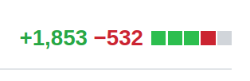
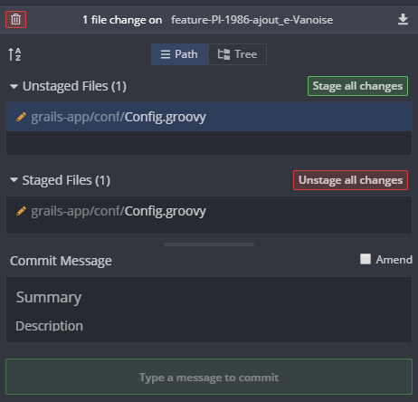

# Personne n'a pris le temps de reviewer ma (gigantesque) PR :worried:

Bob a développé une user-story dans une code-base legacy<sup>[^1]</sup>.

Le Dod<sup>[^2]</sup> contient, entre autres :

>Le code style de l'équipe est appliqué sur tous les fichiers impactés

Son IDE a donc :
* Changé des CRLF en LF
* Changé des tab en 4 espaces
* Ajouté des espaces avant les accolades
* Ajouté des [trailing-commas](https://developer.mozilla.org/fr/docs/Web/JavaScript/Reference/Virgules_finales) aux listes et aux map
* Re-organisé les imports
* ...

De plus, Bob applique les principes :
* [SRP](https://fr.wikipedia.org/wiki/Principe_de_responsabilit%C3%A9_unique)
* [DRY](https://fr.wikipedia.org/wiki/Ne_vous_r%C3%A9p%C3%A9tez_pas)
* Boy Scout Rule


Sa PR contient des [commits](https://www.conventionalcommits.org/fr/v1.0.0/#sp%c3%a9cification) :
* feat
* chore
* fix (pour corriger des bug mineurs)
* refactor
* test

Et tadaaaaa !



:see_no_evil:

Personne ne se dévoue pour reviewer...

En bon artisan du logiciel, Bob a le respect dans ses valeurs.  
Il sent bien que sa PR n'est pas respectueuse envers sa team.  
La dissonance lui fait alors se dire :
>Let's split it !

## Contraintes
* Chaque sous-PR doit être stable (surtout si votre Github check la stabilité de chacune avec Travis-CI)
* Toutes sous-PR doit être reviewable en parallèle
  * Exemple : pour que celui qui ne connait pas les détails fonctionnels puisse au moins reviewer le refactoring

## Roll up your sleeves

### 1. Un commit pour les gouverner tous :dvd:
Pour faciliter les cherry-pick à venir, Bob créé un merge **local** de sa big-branch dans la branch develop.
```shell
git checkout develop
git merge feature/big-branch
```
(Il n'y a pas de conflit dans le merge, car Bob n'enverrait jamais en review une PR avec des conflits :wink:. Il les a résolut avant)

### 2. Tirer une nouvelle branche depuis l'origine de la branche à splitter

 On choisira un nom proche du nom de la big-branch, mais avec un numéro, afin de bien identifier l'ordre de merge des sous-PR.
```shell
git checkout develop # Le commit d'origine de la big-branch
git co -b feature/01-big-branch
```

### 3. Cherry-pick le big-commit (sans commit)
```
git cherry-pick --no-commit tmp
```
À présent Scalpel, euh non Bob commence le travail de découpage !


 Ce que vous allez mettre dans les sous-branches dépend vraiment de votre contexte.

 Bob, lui, décide de mettre tout le formattage auto de son IDE dans sa première sous-PR.

 Pour cela il stage uniquement les chunk et les lignes concernée.

 Pour rappel dans Git, les lignes nouvelles/modifiées/supprimées peuvent avoir 2 états :
 * staged
 * unstaged



 La commande `git commit` ne commit que les lignes qui sont dans l'état `staged`.

 Les commandes `git add my_file` et `git add --all` envoient 100% des lignes dans l'état `staged`.
 
 Pour stagger partiellement, on peut utiliser la commande `git add -p` ou `git add -p my_file`.

 Git nous guide tout au long de la fonctionnalité, je vous invite donc à l'essayer :)

 Ou bien on utilise un GUI comme [GitKraken](https://www.gitkraken.com/invite/whLo3ms9) :heart_eyes:

 J'aime beaucoup cet outil, mais je ne peux pas me passer de la command-line pour certaines manipulations.

Exemples :

* rebase interractif pour
  * squash
  * ré-écrire un commit en plein milieu de ma branche
* Lancer une résolution de conflits compliquée avec `git mergetool`, qui va ouvrir le merveilleux GUI [Kdiff3](http://kdiff3.sourceforge.net/)
* spliter des chunk à stagger avec `git add -p`
* stash partiel avec `--keep-index`

Tant que je n'ai pas à slippter des chunk de nouveau code, je privilégie GitKraken pour le stage.

Une fois qu'on a bien isolé notre code dans l'état `stagged`, on commit le tout avec un joli message simple mais explicite.

Et on discard tout le reste : `git reset --hard`
 
## 4. ON LANCE LES TESTS

 Rappel de la 1ère contrainte :
>Chaque sous-PR doit être stable

 En cas de fail :
 * On corrige
 * On commit les fix (ou on amend dans le précédent `git commit --amend`)
 * On merge nos fix dans le big-commit temporaire

## 5. Quand la première sous-branche est stable

 On peut déjà la push et lancer la PR vers la branche d'origine (surement la branche develop).

## 6. Deuxième sous-branche

 On la tire depuis la 1ère, et on recommence à l'étape 3.

## 7. PR de la 2nd sous-branche

 Quand la 2ème sous-branche est stable, on lance la PR *vers la précédente sous-branche* (et non vers la branche develop).

 C'est cela qui permet de les reviewer en parrallel : chaque sous-PR ne contient que le diff entre elle et la précédente.

## 8. Quand la 1ère PR est reviewée

 On la merge dans la develop

 PUIS on fait pointer la sous-PR suivante vers la develop !
Les reviews déjà faites ne seront heueusement pas affectées.

## 9. Et on continu ce cycle jusqu'à ce que toutes les sous-PR soient mergées.


[^1]: Legacy (ma définition) : Un code qui a au moins une des caractéristiques suivantes : <br/>- Ne respecte pas les conventions de la team<br/>- N'est pas couvert par des tests d'acceptation<br/>- N'est pas couvert par des tests unitaires<br/>- N'a pas été suffisamment refactoré<br/>- N'est pas compréhensible rapidement par la majorité de la team

[^2]: DOD : Definition Of Done
